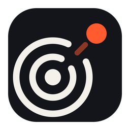
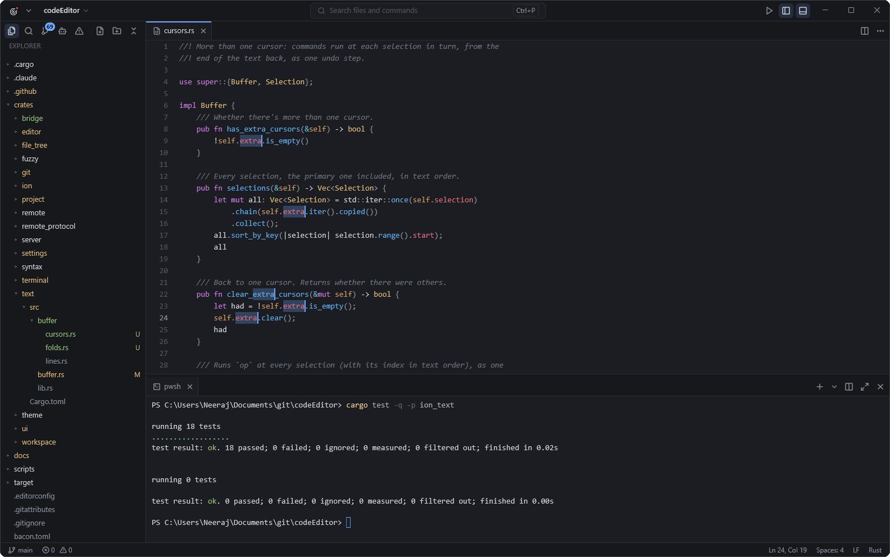
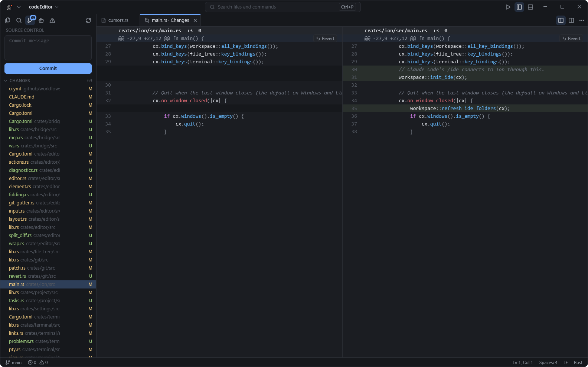
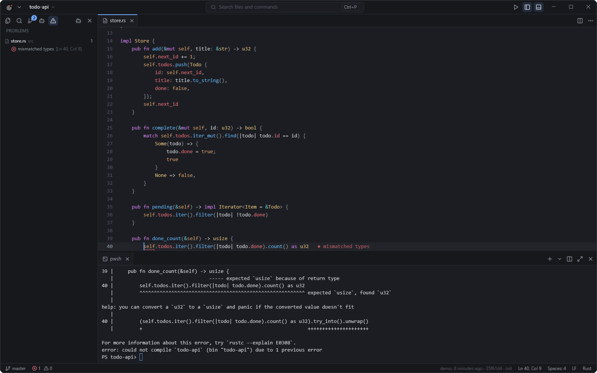
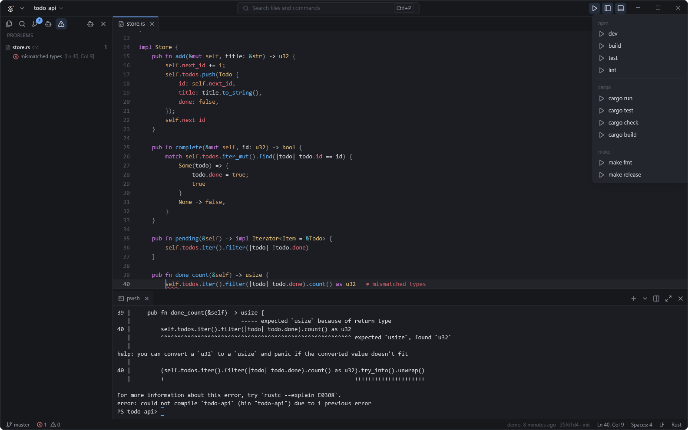
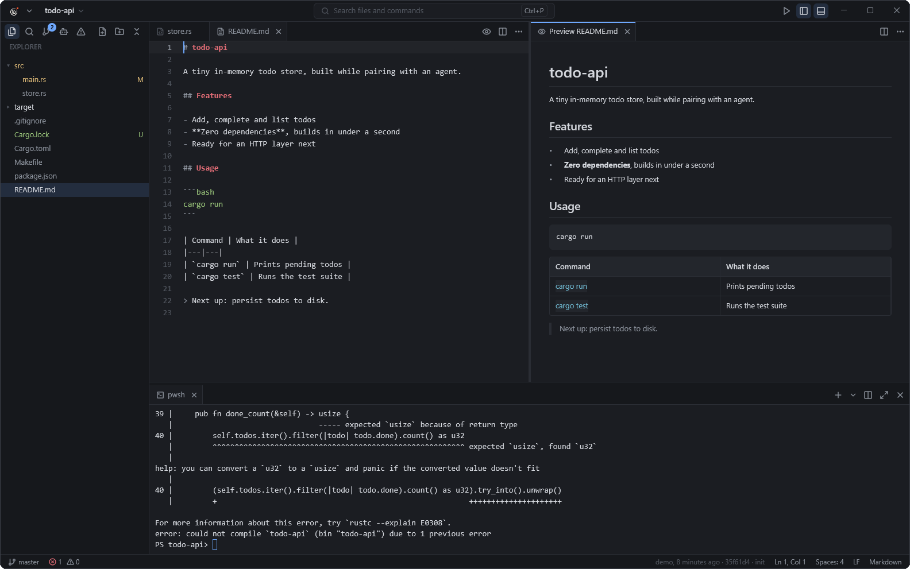

<div align="center">



# Ion

### A simple editor for coding with AI agents

Your agent writes the code. Ion is where you watch it, review it and steer it.

[](https://github.com/neerajsunil/ion/actions/workflows/ci.yml)
[](https://github.com/neerajsunil/ion/releases/latest)
[](#license)

[Download](#install) · [Features](#what-you-can-do) · [Shortcuts](docs/keybindings.md) · [Roadmap](docs/roadmap.md)



</div>

## Why Ion

If you code with Claude Code, Codex, Gemini CLI or another terminal agent,
most of your day is spent asking for changes and checking them. Ion is built
for that.

It doesn't come with its own AI. Bring the agent you already use, run it in
Ion's terminal, and Ion helps you keep track of what it's doing. It's free,
open source, and there's no account to create.

## What you can do

### See what your agent changed

Open files update as the agent edits them. The file tree and the margin show
what changed, and Source Control lists every modified file. Read the diffs
inline or side by side, and undo any part you don't like.



### Keep an eye on every agent

The Agents view shows each agent you're running, whether it's working or
waiting for you, and the files it changed. Turn on **Follow** to watch the
file it's editing as it goes. If an agent finishes or needs input while you're
somewhere else, Ion lets you know.

### Send errors back to the agent

When a build or test fails in the terminal, Ion picks up the errors, marks
them in your code and lists them in Problems. Click **Send to Agent** and the
agent gets the whole list to fix.



### Run your project in one click

The ▶ button finds your project's scripts and targets (npm, pnpm, yarn, bun,
Cargo, Go and Make) and runs each in its own terminal. Click a
`localhost:3000` link in the output to open it in your browser.



### Find things quickly

Press Ctrl+P to jump to any file. Files you've had open, and files your
agent just changed, show up first. Paste a location like `src/app.ts:42`
from the agent's output and you land on that line. Click file paths in
the terminal to open them too.

### Read plans and docs

A live Markdown preview sits beside the file, which is handy for an agent's
`PLAN.md`. There's also an image viewer and word wrap.



### Work on a server

Open a folder on a Linux machine or a Mac over SSH. Files, search, Git and terminals
all run there, so your agent can too. Ion uses your usual SSH setup.
[More about remote projects](docs/remote-development.md).

### And the everyday editing basics

- Multiple cursors, code folding and syntax highlighting
- Find and replace, and search across the project
- Split editors and terminals, and drag tabs anywhere
- Git: stage, commit, switch branches, blame, history, push and pull
- Dark and light themes, and Ion reopens where you left off
- Searchable settings, and shortcuts you can change to suit you

## Works with your agent

**Claude Code** connects to Ion on its own when you start it in an Ion
terminal (or run `/ide` from anywhere). It can then open files and diffs in
Ion, see what you've selected, read your Problems list, and suggest edits you
accept or reject.

**Codex** reads your open file, selection and tabs from Ion with each prompt
once you run `/ide` in it.

**Gemini CLI and any other terminal agent** work as they do anywhere
else. Select some code and press Ctrl+Alt+K to send it to the agent, drag
files onto the terminal, or paste in an image.

## Install

**[Download the latest release](https://github.com/neerajsunil/ion/releases/latest)**
for Windows 11 or a Mac with Apple Silicon.

- **Windows:** unzip it and run `ion.exe`. There's no installer.
- **Mac:** unzip it and drag `Ion.app` to Applications.

Ion is still early, and the downloads aren't signed yet, so your computer may
warn you the first time:

- **Windows:** choose **More info → Run anyway**.
- **Mac:** open Ion once, then go to **System Settings → Privacy & Security**
  and choose **Open Anyway**.

### Build it yourself

You'll need [Rust](https://rustup.rs). On Windows, also install Visual Studio
Build Tools with **Desktop development with C++**. On a Mac, run
`xcode-select --install`. Then:

```bash
git clone https://github.com/neerajsunil/ion.git
cd ion
cargo dev
```

The first build takes a few minutes.

## Shortcuts

On a Mac, use Cmd where you see Ctrl (except Ctrl+\`, which stays the same).

| Shortcut | What it does |
|---|---|
| Ctrl+P | Go to a file |
| Ctrl+Shift+P | Search all commands |
| Ctrl+\` | Show or hide the terminal |
| Ctrl+Shift+A | Agents |
| Ctrl+Shift+G | Source Control |
| Ctrl+Shift+M | Problems |
| Ctrl+Alt+K | Send selection to your agent |
| Ctrl+Shift+V | Markdown preview |

See [all shortcuts](docs/keybindings.md).

## What's next

Next up: checkpoints, so you can save a snapshot before a task and roll back
afterwards, and staging single changes in Git. The [roadmap](docs/roadmap.md)
has the rest, and the [changelog](CHANGELOG.md) has what's new.

## Contributing

Ideas, bug reports and pull requests are all welcome. Please read
[CONTRIBUTING.md](CONTRIBUTING.md) first.

## License

Ion is available under the [Apache 2.0](LICENSE-APACHE) or
[MIT](LICENSE-MIT) license, whichever you prefer. Anything you contribute is
shared under the same terms.
